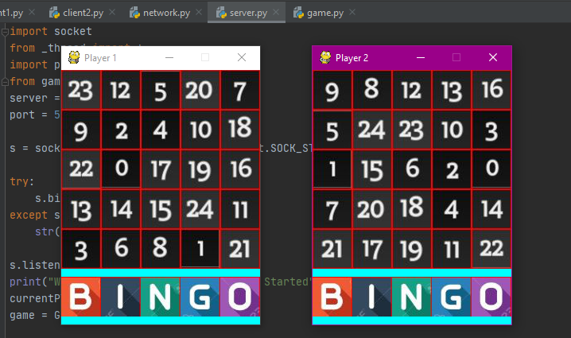
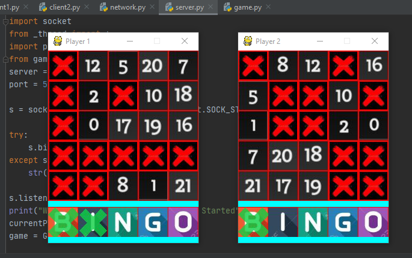

# DesiBingo
A two-player game.

Each of the two players will have a (5x5) board having randomly distributed numbers from 0 to 24. Since the numbers are randomly distributed, So both the players will have different boards.

#### Example board

## Rules
1. The first player will mark any number of it's choice and that number will be marked on both the boards.
(as shown in the figure, 1st player marked number 14 on it's board and now the number 14 is automatically be marked on the other player's board.)
Now, the 2nd player mark any number(from remaining unmarked) of it's choice and in the same way it will be marked on both the boards.
In this way, the game will proceed.

2. As soon as any row, column or diagonal is completely marked the letters of word "BINGO" will start to be cut. The total number of letters that will be cut of the letter "BINGO"
will depend upon the total number of rows, columns or diagonals are completely filled.
(As shown in the figure on 1st player's board, one complete row and one complete column is marked (total 2). So, the first two letters of word "BINGO" of it's board is cut. In the same way on the 2nd player's board only one diagonal is completely marked (total 1). So, only the first letter of "BINGO" is cut.)

