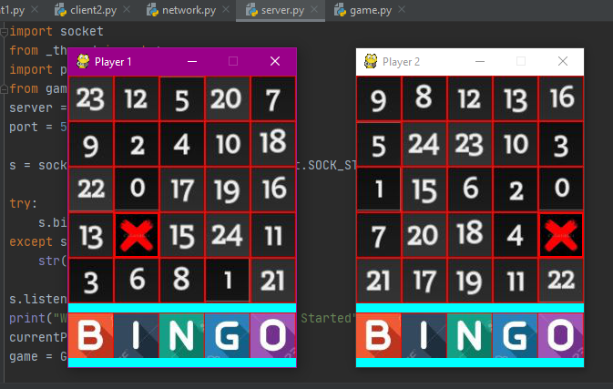

# DesiBingo
A pygame implementation of two-player game which are connected through a server using socket programming.

&nbsp;

### Playing the game.
- Download the ```server.py``` and ```game.py``` file where the server is to be run. Now, change the IP address in the ```server.py``` file with your machine's IP address. Finally, execute the ```server.py``` file.
- At the player1 machine download the ```client1.py``` and ```network.py``` file. Now, change the IP address in the ```network.py``` file to the IP address of machine where server is running. Finally, execute the ```client1.py``` file.
- At the player2 machine do the same procedure as player1 machine but now with file ```client2.py``` and ```network.py``` .
- Now, both the players should be connnected through the server. Therefore, both can now play the game.

Each of the two players will have a (5x5) board having __randomly distributed numbers__ from 0 to 24. Since the numbers are randomly distributed, So both the players will have __different boards__.

#### Example board


&nbsp;

## Rules
1. The first player will mark any number of it's choice and that number will be __marked on both the boards__.
(as shown in the figure, 1st player marked number 14 on it's board and now the number 14 is automatically be marked on the other player's board.)
Now, the 2nd player mark any number(from remaining unmarked) of it's choice and in the same way it will be marked on both the boards.
In this way, the game will proceed.

  

&nbsp;

2. As soon as any row, column or diagonal is completely marked the letters of word "BINGO" will start to be cut. The total number of letters that will be cut will depend upon the total number of rows, columns or diagonals which are completely marked.
(As shown in the figure on 1st player's board, one complete row and one complete column is marked (total 2). So, the first two letters of word "BINGO" of it's board is cut. In the same way on the 2nd player's board only one diagonal is completely marked (total 1). So, only the first letter of "BINGO" is cut.)

  

&nbsp;

3. #### RESULT
  - The player who cut all the letters of "BINGO" first, will __WIN__ the match.
  - If both the player cut all the letters at the same time then the match will be __DRAW__.
  
  &nbsp;
  As shown below 1st player cuts all the letters of "BINGO" as a result he is the WINNER.
   
   
&nbsp;
&nbsp;

## Implementation
- The two players(client1 and client2) are connected to a server using [Socket Programming in Python.](https://www.geeksforgeeks.org/socket-programming-python/)
- All the communication between the two players is done by server.
- When one player mark it's own board's number then that number is sent to the server which further send it to both the players to make changes in their boards correspondingly.
- When one player or both have cut all the letter's of "BINGO", then depending upon the rules mentioned above the result is shown.

__To understand in detail how all these things are implemented, the code is uploaded with comments.__
